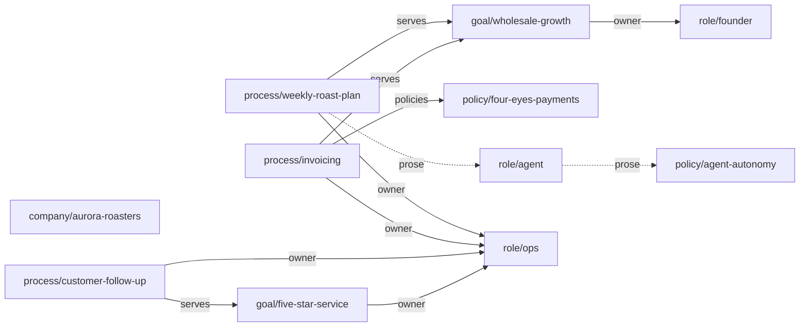

# Company as Code

**Describe your company once — every AI agent works by your rules.**

The knowledge about how your company works lives in your head, in chat messages, and in wiki
pages that nobody updates. That was okay when a new coworker joined every few months. Now every
AI agent session is a new coworker — it starts a hundred times a day, and it knows nothing.

Company as Code is an open standard to write this knowledge down once: goals, roles, processes,
and policies as plain markdown files in git. People can read them. Agents follow them. A small
tool checks them like code.


## What it looks like

One file per resource. A small typed header, then normal language:

```markdown
---
api: company-as-code.org/v0
type: process
id: invoicing
title: Monthly invoicing
owner: role/ops
serves: [goal/wholesale-growth]
policies: [policy/four-eyes-payments]
---

Trigger: 1st of each month. Steps: agent drafts invoices from delivery notes;
ops reviews; send; log. Done when: all invoices sent and logged.
```

The header connects the files into a graph: this process is **owned by** a role, **serves** a
goal, and **follows** a policy. The tool checks every reference. If a reference points to
something that does not exist, validation fails. The text below the header is normal language —
for people and for agents.

Files without the `api:` key are ignored. Your notes and other documents can stay in the same
repository.

## Install

```
brew install pirol-ai/tap/charta
```

```
npm i -g @pirol/charta
```

Works on macOS, Linux, and Windows. Binaries are on the
[releases page](https://github.com/Pirol-ai/company-as-code/releases). To build from source:
`cargo build --release --manifest-path charta/Cargo.toml`.

## Try it in 30 seconds

See what happens when a company description breaks:

```
git clone https://github.com/Pirol-ai/company-as-code && cd company-as-code
bash demo/demo.sh
```

The demo uses a small example company, a coffee roastery ([`demo/company/`](demo/company/) —
open it, it is just files). It deletes the Operations role — the person who runs invoicing and
customer support. Suddenly three processes have no owner. `charta validate` finds every broken
reference. `charta plan` shows what the change would affect — before it happens.

This is the same company as a graph — generated with `charta graph . --format mermaid`, rendered
by GitHub:



Delete `role/ops` and you can see the problem before the tool tells you: four arrows point at it.
`--format dot` gives the same graph as Graphviz DOT for every other tool.

## Start your own

You do not need this repository — only the installed tool:

```
mkdir my-company && cd my-company && git init
charta init                # creates company.yaml: the root of your description
charta validate .          # check it any time — every reference must resolve
```

The other commands, once you have a few files:

```
charta query orphans .     # which resources does nothing reference?
charta plan .              # what would your uncommitted change affect?
charta graph . --format mermaid   # the graph, rendered by GitHub
charta mcp .               # serve the company graph to any MCP-capable agent
```

Want a filled-in starting point instead of an empty one? Copy [`template/`](template/) from this
repository.

**You do not write this alone — your agent writes it with you.** Tell your agent how your
company works, in your own words. The agent writes the files, runs `charta validate`, and fixes
what is broken. Start with what a new coworker would need to know on day one — every agent
session is that new coworker.

The description then grows while you work: when an agent asks a question that only you can
answer, that answer is a missing file. The agent adds it, validates it, and never asks again.
Start small. Add more only when you need it.

## The toolchain

`charta` is one small binary (Apache-2.0):

| command | what it does |
|---|---|
| `charta validate` | checks the description: files are well-formed, every reference resolves, required fields exist |
| `charta graph` / `charta query` | the graph as JSON, Mermaid, or Graphviz DOT (`--format`); find orphans and backlinks |
| `charta plan` | compares your working tree with the last git commit and shows what a change would affect |
| `charta mcp` | an MCP server — AI agents can read and query the company graph as tools |

Details in [`charta/`](charta/).

## Layout

| Path | What |
|---|---|
| [`spec/`](spec/) | The format: purpose, header fields, types, references, conformance levels. Working draft; frozen at 1.0. |
| [`conformance/`](conformance/) | Test fixtures. The test suite defines the standard, not the prose. |
| [`charta/`](charta/) | The reference toolchain (Rust). |
| [`template/`](template/) | A minimal starter company. |
| [`demo/`](demo/) | An example company and the 30-second demo. |

## OKF compatible

Company as Code is **100% compatible with Google's
[Open Knowledge Format (OKF)](https://github.com/GoogleCloudPlatform/knowledge-catalog/blob/main/okf/SPEC.md)**.
Every resource file is also a valid OKF concept. The fields `type`, `title`, `description`, and
`tags` have the same meaning as in OKF. Unknown fields are kept, never deleted. OKF files can
live in the same repository; charta ignores them. On top of OKF, Company as Code adds: an `id`,
addressing (`type/id`), references that must resolve, and required fields per type.

## Design rules

1. **Text first, schema small.** The meaning lives in normal language. Structure lives in the
   header. Every extra field makes adoption harder.
2. **Check the structure, not the text.** Strict process notations failed because they demanded
   too much precision from people. Agents can handle normal language. Only references and
   required fields are enforced.
3. **The description belongs to you, not to a tool.** The files on disk are the exchange format.
   Export is `git clone`.
4. **Keep what you do not know.** Unknown types and fields are preserved exactly. Read and write
   must not change a file.
5. **No new language.** Markdown and YAML — nothing to learn. No query language: fixed commands,
   JSON output, agents combine them.

## License

Toolchain and fixtures: Apache-2.0 ([LICENSE](LICENSE)). Specification text: CC-BY-4.0
([spec/LICENSE](spec/LICENSE)). An open standard, created and maintained by
[Pirol Labs](https://pirol.ai).
